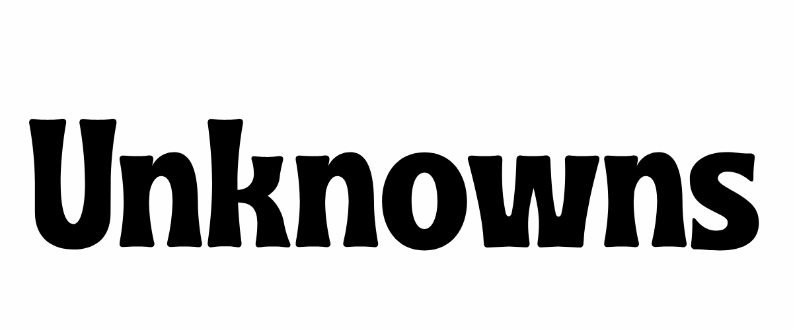
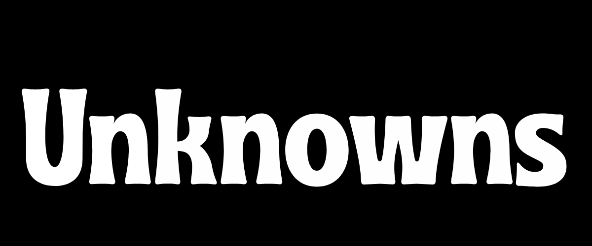

<p align="center">
  
  &nbsp;&nbsp;&nbsp;
  
</p>

<h1 align="center">Unknowns</h1>

<p align="center">
  <strong>Say it. Stay unknown.</strong>
</p>

<p align="center">
  Anonymous messaging platform for sharing thoughts and feedback.
</p>

## Features

- Anonymous messages
- Personal profile link
- Send messages without revealing identity
- Receive and manage messages
- Mark messages as favorite
- Delete messages
- Message categories
- User authentication

## Tech Stack

- Laravel 12
- Vue 3
- Pinia
- Tailwind CSS
- MySQL
- Laravel Sanctum

## How It Works

1. Create an account
2. Choose your username
3. Get your personal link
4. Share your link
5. Receive anonymous messages
6. Manage your messages from the dashboard

## Project Structure

```text
unknowns/
├── backend/
│   └── Laravel
│
└── frontend/
    └── Vue 3
